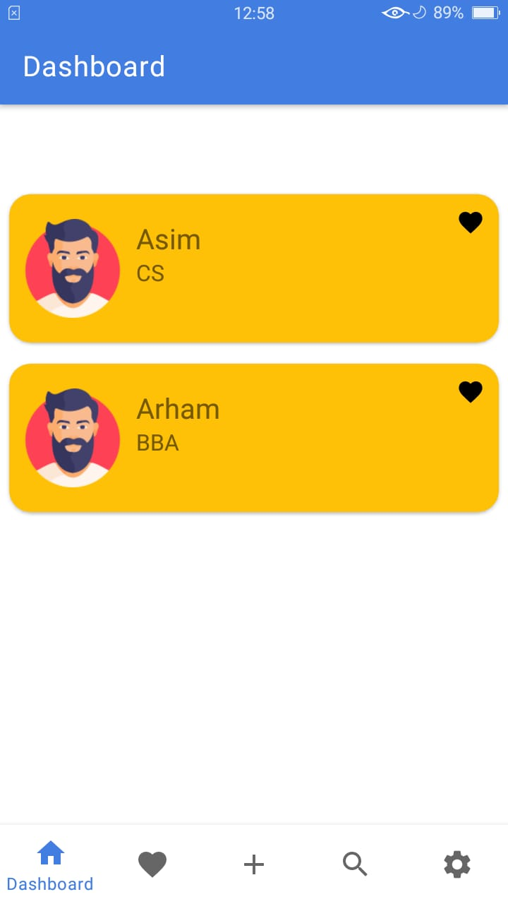
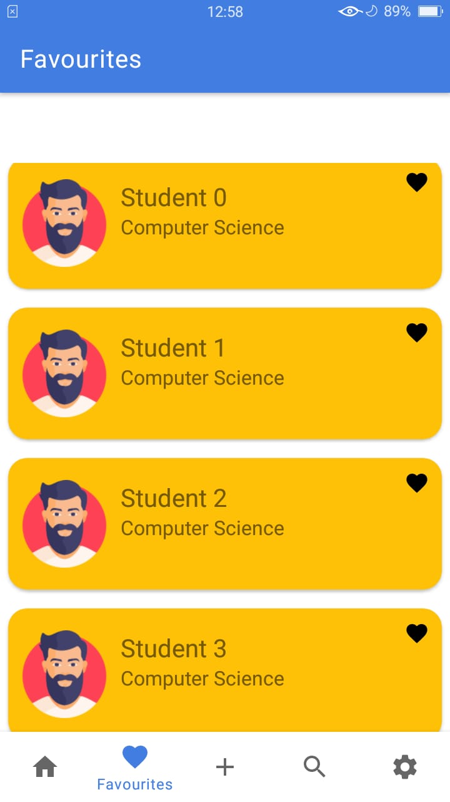
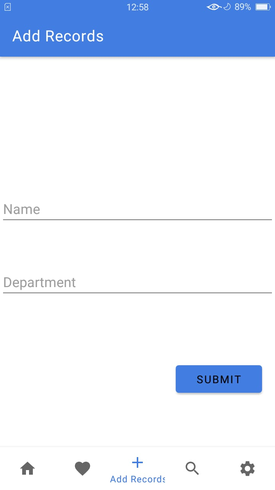

# Student Info App
An android application that provides a simple interface to displaying the information about the student with different android components utilization

## 🔎 Features:

 - Splash screen
 - Add Record
 - Add Favorite
 - Local DataBase.
 - Fetch Api and show the memes in the search results
 - Complete Navigation

## 💻 Tools:
 - Kotlin
 - RecyclerView
 - Roam Local DB
 - Retrofit

## Dashboard

## Favourites

## Add Record

## 🤝 Start contributing

Make sure you have all the basic tools before you start working on this project.